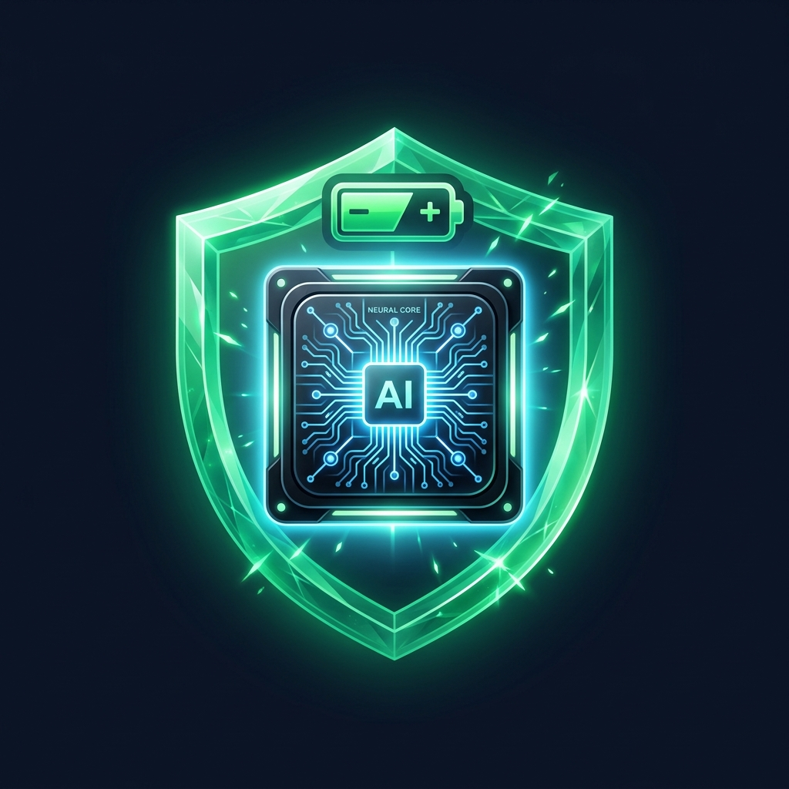
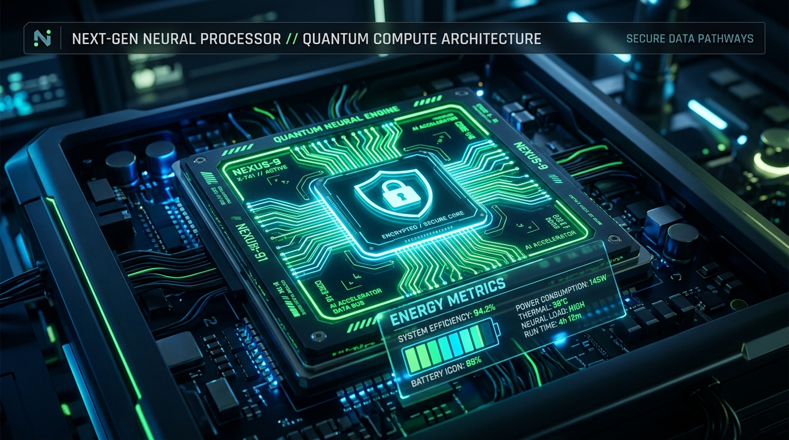

<p align="center">
  
</p>

<h1 align="center">NeuroLocal AI • هوش مصنوعی لوکال</h1>

<p align="center">
  <strong>اجرای کاملاً آفلاین مدل‌های هوش مصنوعی روی گوشی با مدیریت پیشرفته مصرف باتری و تضمین ۱۰۰٪ حریم خصوصی</strong><br>
  <em>On-Device Local AI Runtime & Battery-Optimized Privacy Engine for Android</em>
</p>

<p align="center">
  
  
  
  
  
  
</p>

<p align="center">
  
</p>

---

## 🌟 فهرست مطالب (Table of Contents)
- [معرفی پروژه (Introduction)](#-معرفی-پروژه-introduction)
- [چرا NeuroLocal؟ (Why NeuroLocal?)](#-چرا-neurolocal-why-neurolocal)
- [ویژگی‌های کلیدی (Key Features)](#-ویژگیهای-کلیدی-key-features)
- [پروفایل‌های مصرف باتری (Battery Power Profiles)](#-پروفایلهای-مصرف-باتری-battery-power-profiles)
- [مدل‌های هوش مصنوعی محلی (Supported AI Models)](#-مدلهای-هوش-مصنوعی-محلی-supported-ai-models)
- [سپر حریم خصوصی و امنیت (Privacy Shield & Security)](#-سپر-حریم-خصوصی-و-امنیت-privacy-shield--security)
- [بخش‌های اپلیکیشن (Application Screens)](#-بخشهای-اپلیکیشن-application-screens)
- [معماری فنی و تکنولوژی‌ها (Tech Stack)](#-معماری-فنی-و-تکنولوژیها-tech-stack)
- [نصب و راه‌اندازی (Installation & Build)](#-نصب-و-راهاندازی-installation--build)
- [لایسنس (License)](#-لایسنس-license)

---

## 📖 معرفی پروژه (Introduction)

**NeuroLocal AI** یک رانتایم اختصاصی و بهینه‌سازی‌شده برای سیستم‌عامل اندروید است که به کاربران اجازه می‌دهد مدل‌های پیشرفته زبانی و چندوجهی هوش مصنوعی را **به صورت ۱۰۰٪ آفلاین و مستقیم روی پردازنده گوشی** اجرا کنند.

این اپلیکیشن با هدف حل دو دغدغه اساسی در دنیای هوش مصنوعی توسعه داده شده است:
1. **امنیت و حریم خصوصی داده‌ها:** حذف کامل نیاز به اینترنت و سرورهای خارجی تا اسناد، پیام‌ها و کدهای محرمانه هرگز از دستگاه خارج نشوند.
2. **جلوگیری از تخلیه سریع باتری گوشی:** استفاده از کوانتایز ۴ بیتی (INT4)، اختصاص هوشمند هسته‌های کم‌مصرف، مکث دینامیک بین توکن‌ها (Dynamic Pacing) و محافظ حرارتی خودکار (Auto Thermal Guard) جهت خنک نگه داشتن پردازنده و افزایش طول عمر باتری.

---

## ⚡ چرا NeuroLocal؟ (Why NeuroLocal?)

| ویژگی | هوش مصنوعی ابری معمولی (Cloud AI) | NeuroLocal (On-Device AI) |
| :--- | :--- | :--- |
| **وابستگی به اینترنت** | اجباری (کند در اینترنت ضعیف) | **صفر (کاملاً آفلاین در حالت هواپیما)** |
| **امنیت اطلاعات** | ارسال متن و فایل به سرورهای ابری ثالث | **۱۰۰٪ ایزوله روی رم و حافظه داخلی گوشی** |
| **مصرف باتری** | مداوم روشن بودن مودم 4G/5G و وای‌فای | **مهار مصرف با معماری INT4 و هسته‌های کم‌مصرف** |
| **دمای پردازنده** | بار سرور | **محافظت خودکار با کنترل دمای پیل باتری (<39°C)** |
| **پالایش کدهای محرمانه** | خیر | **پالایش خودکار کد ملی، کارت شتاب و شماره تماس** |

---

## 🚀 ویژگی‌های کلیدی (Key Features)

### ۱. پردازش محلی بدون مجوز اینترنت (Zero Cloud Telemetry)
در فایل `AndroidManifest.xml` اپلیکیشن، مجوز `INTERNET` به طور عمدی حذف شده است. این ساختار از نظر مهندسی نرم‌افزار، امکان برقراری هرگونه ارتباط شبکه‌ای یا ارسال پکت اطلاعاتی را از طرف سیستم‌عامل به صورت ریاضی غیرممکن می‌سازد.

### ۲. گاورنر حرارتی و باتری (Battery & Thermal Governor)
- نظارت بلادرنگ بر سنسورهای باتری از طریق `Android BatteryManager`:
  - درصد شارژ باتری با نوار دینامیک
  - دمای دقیق پیل باتری (°C)
  - ولتاژ لحظه‌ای باتری (mV)
  - تخمین مدت زمان باقی‌مانده استنتاج مداوم (ساعت)
- **محافظ حرارتی خودکار (Auto Thermal Guard):** در صورت بالا رفتن دمای باتری به بیش از ۳۹ درجه سانتی‌گراد، برنامه گام‌های پردازشی را کاهش می‌دهد تا به باتری آسیب نرسد.

### ۳. استنتاج توکن به توکن با سرعت‌سنج زنده
- تولید استریمینگ پاسخ‌ها به همراه سرعت‌سنج نرخ تولید توکن (**Tokens Per Second - TPS**)
- زمان تا اولین توکن (**Time to First Token - TTFT**)
- محاسبه مقدار مصرف واقعی انرژی بر حسب میلی‌آمپر ساعت (**mAh**) در هر درخواست.

### ۴. سپر حریم خصوصی و پالایش داده‌ها (PII Redactor)
الگوریتم‌های تطبیق الگوی محلی برای شناسایی و سانسور اطلاعات حساس پیش از ذخیره‌سازی:
- کد ملی ۱۰ رقمی ایرانی
- شماره کارت‌های ۱۶ رقمی شبکه بانکی شتاب
- شماره‌های موبایل اپراتورهای همراه
- آدرس‌های ایمیل

### ۵. آزمایشگاه تست و بنچمارک باتری (Battery Lab)
- ابزار اندازه‌گیری عملکرد و بازدهی مصرف انرژی با اجرای تست ۱۲۰ توکنی و محاسبه امتیاز بهره‌وری (Efficiency Score).
- ثبت کلیه سوابق بنچمارک در دیتابیس Room با نمودار مقایسه‌ای.

---

## 🔋 پروفایل‌های مصرف باتری (Battery Power Profiles)

کاربر می‌تواند با توجه به میزان شارژ و نیاز پردازشی، بین ۳ پروفایل بهینه‌سازی انتخاب کند:

```
[ 🔋 Eco Saver ]      -> کوانتایز INT4 • تک‌هسته کم‌مصرف • وقفه 28ms • مصرف: ~1.4 mAh/1K • پایداری: 7.8 ساعت
[ ⚖️ Balanced ]       -> کوانتایز INT8 • دو تا چهار هسته • وقفه 12ms • مصرف: ~2.9 mAh/1K • پایداری: 4.5 ساعت
[ ⚡ Turbo Max ]       -> دقت FP16 • حداکثر هسته‌ها/GPU • بدون وقفه • مصرف: ~5.8 mAh/1K • پایداری: 2.1 ساعت
```

---

## 🧠 مدل‌های هوش مصنوعی محلی (Supported AI Models)

NeuroLocal شامل پیکربندی‌های بهینه‌سازی‌شده برای ابعاد مختلف سخت‌افزار موبایل است:

1. **NeuroLlama-1B Mobile (INT4):** مدل سبک ۱.۱ میلیارد پارامتری فشرده‌شده برای موبایل، مصرف رم ۸۴۰ مگابایت، بسیار کم‌مصرف برای کارهای روزمره و گفتگو.
2. **Gemma-2B Quantized (INT4/INT8):** معماری متن‌باز گوگل، مصرف رم ۱.۴ گیگابایت، مناسب برای خلاصه‌سازی اسناد سنگین، کدنویسی و ترجمه.
3. **Phi-3 Mini Edge (3.8B INT4):** مدل استدلال منطقی و ریاضی عمیق بدون اینترنت، مصرف رم ۲.۱ گیگابایت.
4. **VisionMini Tensor-Core:** خط‌لوله بینایی ماشین برای تحلیل ابعاد، هیستوگرام رنگ، روشنایی Luma و بافت تصاویر کاملاً محلی.

---

## 🛡️ سپر حریم خصوصی و امنیت (Privacy Shield & Security)

- **Zero Network Permission:** اپلیکیشن هیچ دسترسی به سوکت شبکه ندارد.
- **In-Memory Matrix Compute:** محاسبات ماتریسی مستقیماً در RAM ایزوله برنامه صورت می‌گیرد.
- **Local SQLite Sandbox:** فایل پایگاه‌داده `neurolocal_encrypted_vault.db` در فضای حفاظت‌شده اپلیکیشن نگهداری می‌شود.
- **Wipe & Purge:** دکمه امحای فوری تمام پیام‌ها و سوابق بنچمارک با یک لمس.

---

## 📱 بخش‌های اپلیکیشن (Application Screens)

| تب اپلیکیشن | نام فارسی | شرح عملکرد |
| :--- | :--- | :--- |
| **Runtime** | **موتور مدل** | انتخاب مدل، مانیتورینگ زنده باتری و دما، اسلایدر هسته‌ها، سوئیچ محافظ حرارتی |
| **Local Chat** | **گفتگوی لوکال** | چت تعاملی زنده، سرعت‌سنج TPS و mAh، استریم توکن‌ها، پیشنهادات آماده |
| **Tasks** | **وظایف هوش** | پالایش کدهای ملی/کارت‌های بانکی (PII)، خلاصه‌ساز متن و تحلیلگر تنسور تصویر |
| **Battery Lab** | **لابراتوار باتری** | اجرای تست توان مصرفی، ثبت امتیاز بهره‌وری و تاریخچه بنچمارک‌ها |
| **Privacy Vault** | **صندوق امنیت** | چک‌لیست گواهی عدم دسترسی به شبکه و ابزار امحای کامل داده‌ها |

---

## 🛠️ معماری فنی و تکنولوژی‌ها (Tech Stack)

- **زبان برنامه‌نویسی:** Kotlin 2.2.10
- **رابط کاربری:** Jetpack Compose با Material Design 3 و هماهنگی کامل با حالت تیره AMOLED
- **پایداری داده‌ها:** Android Room 2.7.0 همراه با KSP (Kotlin Symbol Processing)
- **همزمانی و پردازش غیرهمگام:** Kotlin Coroutines & Flow (`StateFlow`, `collectAsStateWithLifecycle`)
- **سنسورها و سخت‌افزار:** Android `BatteryManager` Broadcast Receiver و پایش حرارتی پیل باتری
- **تصاویر و گرافیک:** ابزارهای بومی `Canvas` و `Coil Compose`

---

## 📥 نصب و راه‌اندازی (Installation & Build)

### روش اول: دانلود مستقیم فایل APK آماده
فایل‌های خروجی بیلد در ریشه پروژه در دایرکتوری `build_app/` قرار دارند:
- **مسیر فایل:** `build_app/neurolocal-debug.apk` یا `build_app/app-debug.apk`
- حجم فایل: حدود ۲۴ مگابایت

### روش دوم: بیلد پروژه با گریدل (Gradle)

```bash
# کلون کردن ریپازیتوری
git clone https://github.com/your-username/neurolocal-ai.git
cd neurolocal-ai

# کامپایل و اجرای تست‌های محلی
gradle :app:testDebugUnitTest

# بیلد نسخه نصبی APK
gradle :app:assembleDebug
```

فایل نصبی پس از بیلد در مسیر زیر تولید می‌شود:
```
app/build/outputs/apk/debug/app-debug.apk
```

---

## 📄 لایسنس (License)

این پروژه تحت مجوز متن‌باز **MIT License** منتشر شده است. استفاده، بازنشر و شخصی‌سازی آن با ذکر نام پروژه آزاد است.
